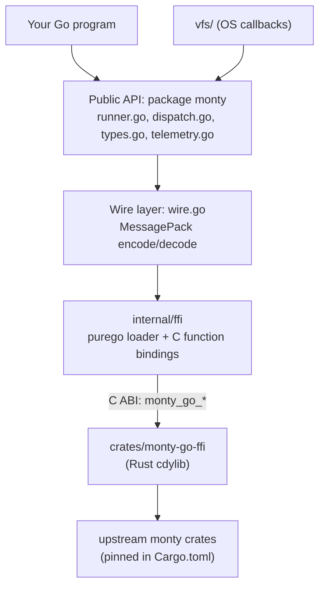
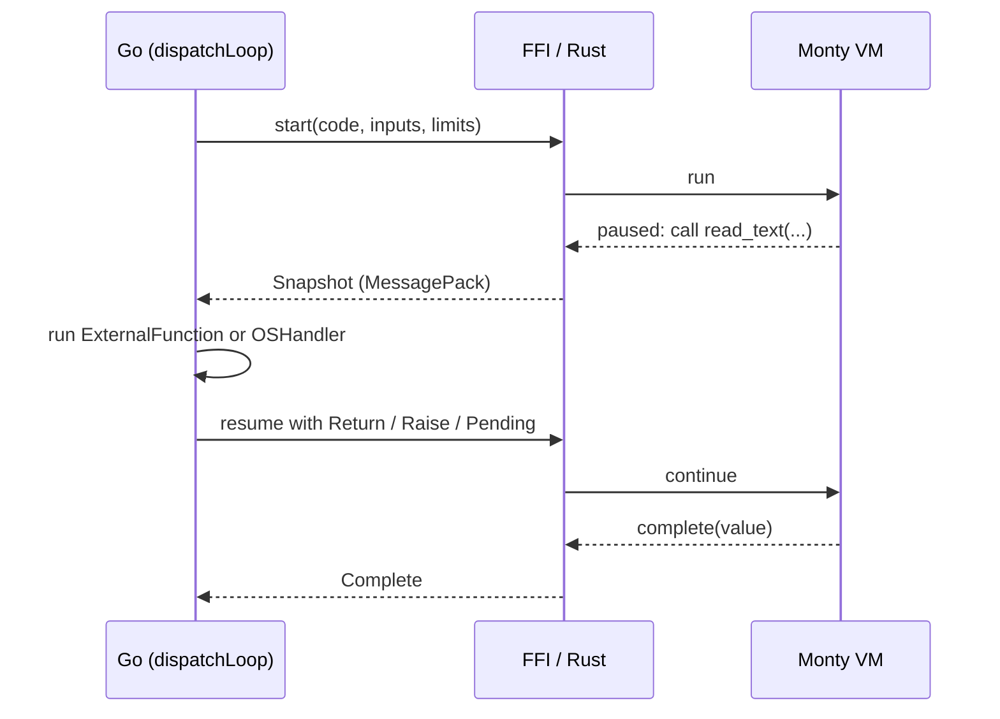

# Architecture

gomonty lets Go call Monty without cgo. Four layers sit between your code and the interpreter.

## Layers

| Layer | Files | Responsibility |
| --- | --- | --- |
| Public API | `runner.go`, `dispatch.go`, `types.go`, `errors.go`, `telemetry.go` | `Runner`, `Repl`, progress snapshots, `Value`, `ResourceLimits`, host callbacks, errors, telemetry hooks. |
| Wire | `wire.go`, `crates/monty-go-ffi/src/wire.rs` | Converts Go `Value`s and Rust `MontyObject`s to and from MessagePack. Each value kind has a `WIRE_VALUE_*` tag. |
| FFI loader | `internal/ffi/ffi.go`, `lib_<os>_<arch>.go`, `load_library_*.go` | Embeds the shared library for the platform, extracts it to `os.UserCacheDir()` (falling back to `os.TempDir()`), opens it with purego and binds the C functions. |
| Rust crate | `crates/monty-go-ffi/src/lib.rs` | Exports `monty_go_*` C functions (runner, REPL, progress, dump/load, type check, error formatting) over upstream Monty. Headers are generated into `internal/ffi/include/` by cbindgen. |

If the library cannot be extracted or loaded, the public API returns a "native bindings unavailable" error instead of panicking.

## How a run executes

Monty does not call back into the host. When sandboxed code needs something only the host can provide (an external function, an OS call such as `Path.read_text`, a name lookup, or an unresolved future), the interpreter pauses and returns a progress value. `Runner.Run` loops over these in `dispatchLoop` (`dispatch.go`):

The progress types are `Snapshot` (external or OS call), `NameLookupSnapshot`, `FutureSnapshot` (pending async results) and `Complete`. `Run` handles them for you; `Start` returns them so you can drive execution yourself. All three snapshot kinds support `Dump`, and `LoadSnapshot` restores them, so execution can be persisted and resumed elsewhere.

Handlers return a `Result`: `Return(value)`, `Raise(exception)` (surfaced as a Python exception inside the sandbox) or `Pending(waiter)` (resolved later through `FutureSnapshot.ResumeResults`).

## Safety boundaries

- The sandbox has no ambient access. Files come only from the `vfs.FileSystem` you supply, and environment variables from the `vfs.Environment`.
- `ResourceLimits` bound duration, memory, GC interval, recursion depth and the number of host-call suspensions. A zero `MaxRecursionDepth` or `MaxSuspensions` falls back to upstream's default rather than unlimited.
- `context.Context` cancellation is checked between dispatch steps.

## Telemetry

Telemetry is off unless `RunOptions.Telemetry` is set. `dispatchLoop` records a root span (`monty.run`, or `monty.feed` for the REPL) with child spans for host callbacks (`monty.call`) and future waits (`monty.wait`) and accumulates callback/wait timing. Argument and result recording is a separate opt-in (`TelemetryOptions`) because those values may carry secrets, and handler panics are isolated from the run. `SlogHandler` is built in; `otelmonty/` maps the same events to OpenTelemetry. The design is in [`gomonty-olly.md`](../gomonty-olly.md).

## Repository modules

| Module | Path | Purpose |
| --- | --- | --- |
| library | `.` (with `vfs/`, `internal/ffi/`) | The `monty` package. |
| examples | `examples/` | Runnable programs; depends on the library through a `replace` directive. |
| OpenTelemetry bridge | `otelmonty/` | Separate module so the OTel SDK is never a dependency of the library. |
| REPL | `cmd/shmonty/` | Terminal REPL (`make shmonty`). |

The Rust crate lives in `crates/monty-go-ffi`. Prebuilt libraries under `internal/ffi/lib/` are committed only by the `release-prep` workflow; see [`RELEASING.md`](../RELEASING.md).

## Adding or changing a value type

Changes flow top-down: upstream `MontyObject` → `wire.rs` → `wire.go` → `types.go`. Never renumber `WIRE_VALUE_*` constants: Go assigns them with `iota`, so the order must match Rust. The `upstream-refresh` skill (`.agents/skills/upstream-refresh/`) walks through the full procedure.
