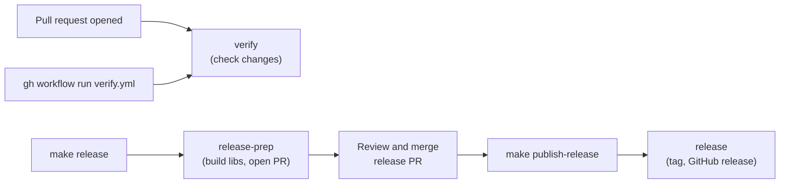

# Continuous integration and release workflows

gomonty has three GitHub Actions workflows in [`.github/workflows/`](../.github/workflows). `verify` checks changes, `release-prep` builds the native libraries and opens a release PR, and `release` tags and publishes what `release-prep` committed. For the step-by-step release procedure see [`RELEASING.md`](../RELEASING.md).



## Why the libraries are built in CI

The Go package embeds a prebuilt native library per platform, and Go consumers receive whatever is committed at the tag. So the libraries cannot be built on a developer's machine: only the `release-prep` workflow commits them (see the rules in [`AGENTS.md`](../AGENTS.md)). Feature PRs never include `internal/ffi/lib/**`, the generated header or `internal/ffi/checksums.txt`.

## `verify`

**Triggers:** a PR being *opened*, or manual dispatch. It deliberately does **not** run on later pushes to the PR, to save runner time. To check a later commit:

```bash
gh workflow run verify.yml --ref <branch>
```

Permissions are read-only (`contents: read`).

| Job | Runner | What it does |
| --- | --- | --- |
| `go-pure` | ubuntu (amd64) | `gofmt -l .` and `cargo fmt --all --check`; builds the native library; `cargo test -p monty-go-ffi --locked`; `CGO_ENABLED=0 go test ./...` and `go vet ./...` on the root module; runs `examples/cmd/example`; tests `otelmonty` and builds its example; vets and tests `cmd/shmonty`. |
| `platform-verify` (linux-arm64) | `ubuntu-24.04-arm` | Builds the library for `aarch64-unknown-linux-gnu`, then runs the root module's Go tests. |
| `platform-verify` (darwin-arm64) | `macos-14` | Same for `aarch64-apple-darwin`. |
| `verify-musl-amd64`, `verify-musl-arm64` | ubuntu (amd64, arm64) | Builds the musl library inside a `rust:1.96-alpine3.21` container. **Build only**: no Go tests. **Off by default**; see below. |

Notes:

- Windows is not verified here. The Windows library is built only during `release-prep`.
- The `platform-verify` jobs run only the root module's tests. The `examples`, `otelmonty` and `cmd/shmonty` modules are tested only in `go-pure` on linux/amd64.
- Fuzz targets, benchmarks and clippy are not run in CI.
- Every job builds the Rust crate from scratch or from the `Swatinem/rust-cache` cache, so the first run after a dependency change is slow (upstream Monty is compiled).

### Enabling the musl checks

The musl jobs are skipped unless the repository variable `RUN_MUSL_CI` is `true`, because they add several minutes to each PR and no known consumer targets Alpine:

```bash
gh variable set RUN_MUSL_CI --body true --repo mdfranz/gomonty
gh variable delete RUN_MUSL_CI --repo mdfranz/gomonty   # turn it off again
```

Turn it on when a change touches the build script, the FFI crate's dependencies or the musl loader files.

## `release-prep`

**Trigger:** manual dispatch with a `version` input such as `v0.0.18`, normally through `make release` (or `make release VERSION=vX.Y.Z`). It must run on `main`, and the version must match `vN.N.N` with an optional suffix. A `concurrency` group per version prevents two preps of the same version at once.

Jobs:

1. `header-and-linux-amd64` builds the C header (with `cbindgen`, installed with `cargo install --locked`) and the linux/amd64 library, and uploads them and `Cargo.lock` as artifacts.
2. `shared-libraries` (matrix: linux-arm64, darwin-arm64, windows-amd64) and the two musl jobs build the remaining libraries in parallel, each uploading its library as an artifact.
3. `open-pr` downloads every artifact, then:
   - fails if the tag already exists;
   - bumps the version in `Cargo.toml` and in `Cargo.lock`'s own `monty-go-ffi` entry (the lockfile was generated before the bump, so without this, later `--locked` builds fail);
   - copies the header and all six libraries into `internal/ffi/`;
   - writes `internal/ffi/checksums.txt` (SHA-256 of `Cargo.lock`, the header and the six libraries);
   - runs `go test ./...`, `go vet ./...` and the `examples` smoke run on the resulting tree;
   - commits to `release-prep/<version>` as `github-actions[bot]` and opens a PR titled `Release <version>`. If nothing changed it skips the PR; if the PR already exists it reuses it.

You review and merge that PR like any other. It is the only place libraries are committed.

## `release`

**Trigger:** manual dispatch with the same `version`, normally `make publish-release VERSION=vX.Y.Z` after the release PR merges. It must run on `main` and has the narrowest permissions of the three (`contents: write` only for the one job).

It **does not rebuild anything**. The FFI builds are not reproducible, so a rebuild would attach binaries that differ from those users get from the tag. Instead it:

1. fails if the tag already exists;
2. checks that `Cargo.toml`'s version matches the requested version, so a skipped or unmerged release-prep is caught;
3. checks that `checksums.txt` covers every expected file and that `sha256sum --check` passes, so a change merged after release-prep (for example an upstream pin bump) is caught;
4. runs `go test ./...`, `go vet ./...` and the `examples` smoke run against the committed tree;
5. tags the dispatched commit and pushes the tag;
6. creates the GitHub release with notes generated from `git log` since the previous tag, attaching the libraries (renamed per platform, because asset names must be unique) and `checksums.txt`;
7. warms the Go module proxy with `go list -m` so `go get` sees the version immediately.

The commit that was dispatched (`GITHUB_SHA`) is the one validated and tagged, so a merge to `main` mid-run cannot change what is released.

GitHub release assets are a convenience: Go users get the libraries from the tagged source tree, not from the release page.

## Common situations

| Situation | What to do |
| --- | --- |
| Pushed more commits to an open PR | `gh workflow run verify.yml --ref <branch>` |
| `release` says the Cargo.toml version is wrong | Run release-prep for that version, merge its PR, retry. |
| `release` says the tree does not match `checksums.txt` | Something changed the libraries or lockfile after release-prep. Re-run release-prep from current `main`. |
| Upstream pin changed after the release PR was opened | Re-run release-prep so the checksums cover the new lockfile. |
| Need to confirm musl builds | Set `RUN_MUSL_CI=true`, then dispatch `verify`. |
| Reproduce CI locally | Build with `MONTY_GO_FFI_SKIP_HEADER=1 scripts/build-go-ffi.sh <triple>`, then `CGO_ENABLED=0 go test ./...` and `cargo test -p monty-go-ffi --locked` (see [contributing.md](./contributing.md)). |

## Known gaps

Open issues: [#32](https://github.com/mdfranz/gomonty/issues/32) (CI: run missing Rust/shmonty/format/fuzz checks and harden workflows; some of its checks may already be in `verify`, so re-read it against the table above), [#33](https://github.com/mdfranz/gomonty/issues/33) (panic guards and clippy), and [#23](https://github.com/mdfranz/gomonty/issues/23) (release builds are not reproducible across runs).
